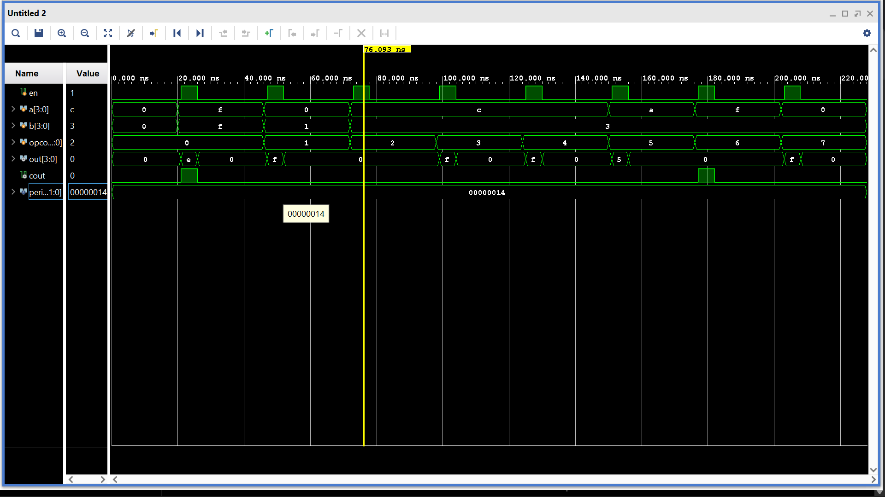
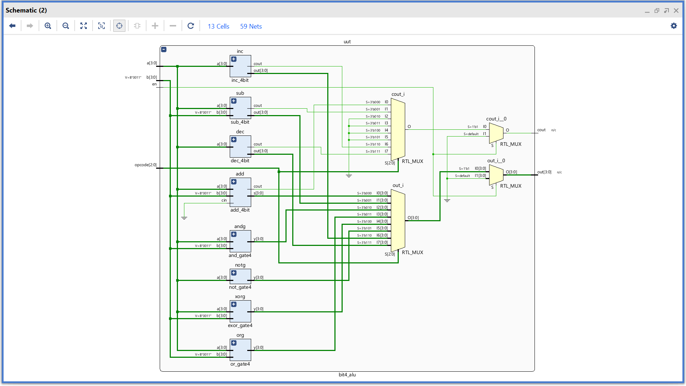

# 4-Bit ALU Design using Verilog

## Overview

This project implements a **4-bit Arithmetic Logic Unit (ALU)** in Verilog HDL.  
The ALU performs various arithmetic and logical operations based on a **3-bit opcode** input.

The design includes:

- Addition
- Subtraction
- AND
- OR
- XOR
- NOT
- Increment
- Decrement

The ALU is enabled using an **enable (`en`) signal**.

---

## Features

- 4-bit arithmetic and logic operations
- Carry-out support for arithmetic operations
- Modular Verilog design
- Testbench with waveform verification
- Simulated in **Vivado/ModelSim**

---

## Inputs and Outputs

### Inputs

| Signal | Size | Description |
|---------|------|-------------|
| `en` | 1-bit | Enable signal |
| `a` | 4-bit | First input operand |
| `b` | 4-bit | Second input operand |
| `opcode` | 3-bit | Operation selector |

### Outputs

| Signal | Size | Description |
|---------|------|-------------|
| `out` | 4-bit | Result output |
| `cout` | 1-bit | Carry/Borrow output |

---

## ALU Operations

| Opcode | Operation | Description | Example | Expected Output |
|---------|------------|-------------|----------|-----------------|
| `000` | ADD | `A + B` | `1111 + 1111` | `out = 1110`, `cout = 1` |
| `001` | SUB | `A - B` | `0000 - 0001` | `out = 1111`, `cout = 0` |
| `010` | AND | `A & B` | `1100 & 0011` | `out = 0000` |
| `011` | OR | `A \| B` | `1100 \| 0011` | `out = 1111` |
| `100` | XOR | `A ^ B` | `1100 ^ 0011` | `out = 1111` |
| `101` | NOT | `~A` | `~1010` | `out = 0101` |
| `110` | INC | `A + 1` | `1111 + 1` | `out = 0000`, `cout = 1` |
| `111` | DEC | `A - 1` | `0000 - 1` | `out = 1111` |

---

## Simulation

The ALU was verified using a Verilog testbench by applying different input combinations for all opcodes.

### Running Simulation

1. Open the project in **Vivado**
2. Run **Behavioral Simulation**
3. Observe waveform outputs

---

## Waveform Result

---

## Schematic Design

---
**Rohit Baskey**

Verilog HDL Project — 4-bit ALU Design
